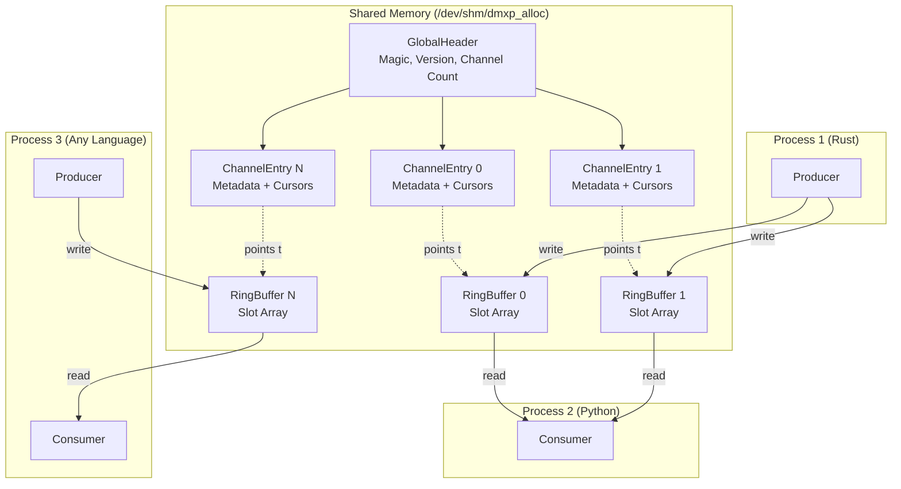
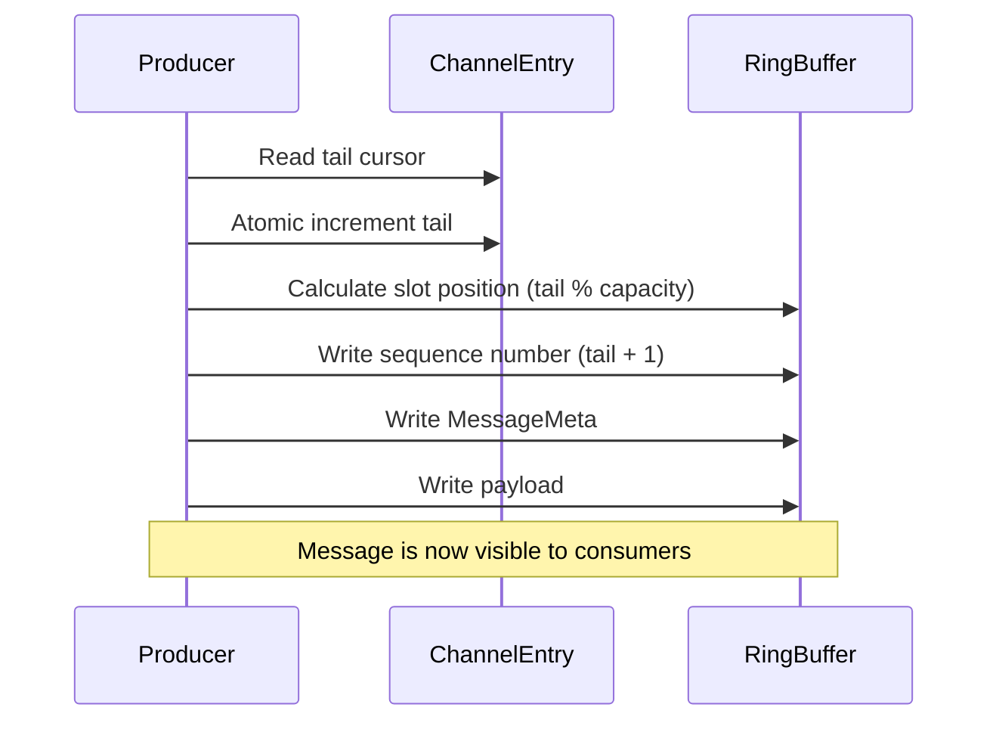
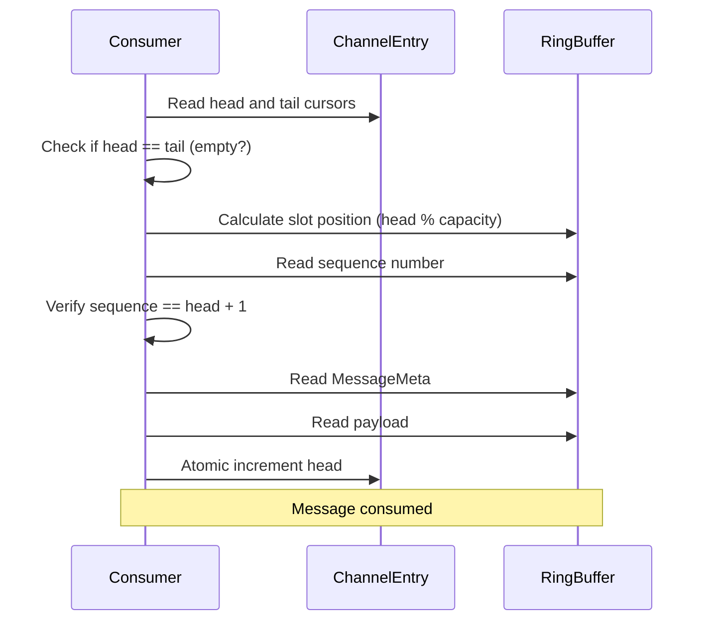

# DMXP-MPMC Architecture

## Overview

DMXP-MPMC (Distributed Multi-Producer Multi-Consumer) is a high-performance, lock-free message passing system using shared memory for cross-process and cross-language communication.

## Key Features

- **Zero-copy messaging** - Direct memory access, no serialization overhead
- **Lock-free operations** - Uses atomic operations for synchronization
- **Cross-language support** - Binary-compatible `#[repr(C)]` structures
- **Multi-channel** - Up to 256 independent channels per shared memory region
- **High throughput** - 2-3 million messages/second in Rust, 300K+ in Python
- **Persistent channels** - Channels survive process restarts

## Architecture Diagram



## Core Components

### 1. GlobalHeader

- **Location**: Offset 0 in shared memory
- **Size**: 98,432 bytes (128-byte aligned)
- **Purpose**: Metadata for the entire shared memory region
- **Contains**: Magic number, version, channel count, array of ChannelEntry

### 2. ChannelEntry

- **Location**: Offset 128+ in GlobalHeader
- **Size**: 384 bytes each (128-byte aligned)
- **Purpose**: Metadata for a single channel
- **Contains**: Channel ID, capacity, ring buffer offset, head/tail cursors

### 3. RingBuffer (Slot Array)

- **Location**: Variable offset (specified in ChannelEntry.band_offset)
- **Size**: capacity × 1088 bytes
- **Purpose**: Actual message storage
- **Contains**: Array of Slot structures

### 4. Slot

- **Size**: 1088 bytes (64-byte aligned)
- **Purpose**: Single message container
- **Contains**: Sequence number, MessageMeta, payload (up to 960 bytes)

## Memory Layout

```
┌─────────────────────────────────────────────────────────────┐
│ GlobalHeader (98,432 bytes)                                 │
│ ┌─────────────────────────────────────────────────────────┐ │
│ │ Magic: 0x444D58505F4D454D ("DMXP_MEM")                  │ │
│ │ Version: 1                                              │ │
│ │ Max Channels: 256                                       │ │
│ │ Channel Count: 4 (active)                               │ │
│ │ Reserved: 0                                             │ │
│ │ Padding: 104 bytes                                      │ │
│ │ ┌─────────────────────────────────────────────────────┐ │ │
│ │ │ ChannelEntry[0] (384 bytes)                         │ │ │
│ │ │   channel_id: 0                                     │ │ │
│ │ │   flags: 0                                          │ │ │
│ │ │   capacity: 1024                                    │ │ │
│ │ │   band_offset: 98432                                │ │ │
│ │ │   tail: CachePadded<AtomicU64> (64 bytes)           │ │ │
│ │ │   head: CachePadded<AtomicU64> (64 bytes)           │ │ │
│ │ └─────────────────────────────────────────────────────┘ │ │
│ │ ChannelEntry[1] (384 bytes)                             │ │
│ │ ChannelEntry[2] (384 bytes)                             │ │
│ │ ...                                                     │ │
│ │ ChannelEntry[255] (384 bytes)                           │ │
│ └─────────────────────────────────────────────────────────┘ │
└─────────────────────────────────────────────────────────────┘
│
│ RingBuffer for Channel 0 (capacity × 1088 bytes)
│ ┌─────────────────────────────────────────────────────────┐
│ │ Slot[0] (1088 bytes)                                    │
│ │ ┌─────────────────────────────────────────────────────┐ │
│ │ │ sequence: AtomicU64 (8 bytes)                       │ │
│ │ │ MessageMeta (40 bytes):                             │ │
│ │ │   message_id: u64                                   │ │
│ │ │   timestamp_ns: u64                                 │ │
│ │ │   channel_id: u32                                   │ │
│ │ │   message_type: u32                                 │ │
│ │ │   sender_pid: u32                                   │ │
│ │ │   sender_runtime: u16                               │ │
│ │ │   flags: u16                                        │ │
│ │ │   payload_len: u32                                  │ │
│ │ │ Padding: 16 bytes                                   │ │
│ │ │ Payload: 960 bytes (actual data)                    │ │
│ │ └─────────────────────────────────────────────────────┘ │
│ │ Slot[1] (1088 bytes)                                    │
│ │ ...                                                     │
│ │ Slot[1023] (1088 bytes)                                 │
│ └─────────────────────────────────────────────────────────┘
│
│ RingBuffer for Channel 1 (capacity × 1088 bytes)
│ ...
```

## Data Flow

### Producer Writing a Message



### Consumer Reading a Message



## Synchronization

### Lock-Free Algorithm

The system uses a **lock-free ring buffer** with atomic operations:

1. **Tail cursor** - Incremented by producers when claiming a slot
2. **Head cursor** - Incremented by consumers when consuming a slot
3. **Sequence number** - Per-slot counter to detect slot readiness

### Sequence Number Protocol

- Sequences start at 1 (not 0)
- When head = 0, the first message has sequence = 1
- When head = N, the next message has sequence = N + 1
- Consumers verify: `slot.sequence == head + 1`

### Cache Line Alignment

- **128-byte alignment** for ChannelEntry to prevent false sharing
- **64-byte alignment** for Slot structures
- **CachePadded<T>** wraps atomics to avoid cache line contention

## Performance Characteristics

### Throughput

- **Rust → Rust**: 2-3 million messages/second
- **Rust → Python**: 300-400K messages/second
- **Bottleneck**: Python's ctypes overhead, not shared memory

### Latency

- **Write latency**: ~100-500 nanoseconds (atomic increment + memory write)
- **Read latency**: ~200-800 nanoseconds (atomic read + memory copy)

### Scalability

- **Channels**: Up to 256 independent channels
- **Processes**: Unlimited (limited by OS)
- **Message size**: Up to 960 bytes inline (larger messages need external storage)

## Design Decisions

### Why Shared Memory?

- **Zero-copy**: No serialization/deserialization overhead
- **Low latency**: Direct memory access, no syscalls
- **Cross-language**: Binary-compatible structures work everywhere

### Why Lock-Free?

- **No contention**: Multiple producers/consumers without blocking
- **Predictable latency**: No lock acquisition delays
- **Scalability**: Performance doesn't degrade with more processes

### Why `#[repr(C)]`?

- **ABI stability**: Guaranteed memory layout across compilers
- **Cross-language**: C-compatible structures work in Python, C++, Go, etc.
- **Portability**: Same layout on all platforms (with little-endian)

## Limitations

1. **Message size**: Maximum 960 bytes inline
2. **Channel count**: Maximum 256 channels per shared memory region
3. **Platform**: Currently Linux-only (uses `/dev/shm`)
4. **Byte order**: Little-endian only (x86, ARM)
5. **Overflow**: Ring buffer wraps at u64::MAX (practically infinite)

## Next Steps

- See [MEMORY_LAYOUT.md](./MEMORY_LAYOUT.md) for detailed structure definitions
- See [BUILDING_CONSUMERS.md](./BUILDING_CONSUMERS.md) for language-specific guides
- See [API_REFERENCE.md](./API_REFERENCE.md) for Rust API documentation
