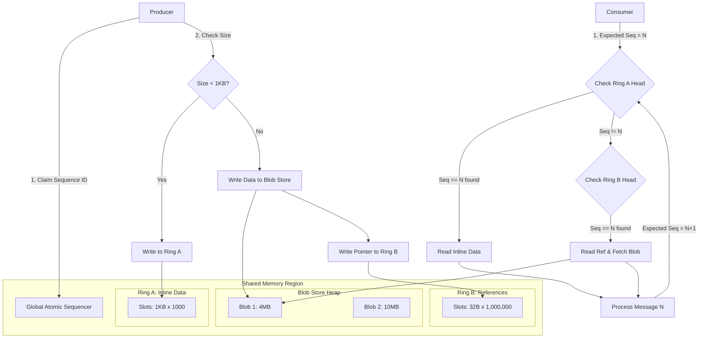

# Future Architecture Proposal: Dual-Ring Hybrid Queue

## Overview

This document outlines a proposed architecture update to DMXP-MPMC to support efficient handling of hybrid workloads (mix of small <1KB messages and large >1KB blobs) while maximizing memory density and throughput.

## Core Concept: The Split-Path Hybrid Queue

Instead of a single Ring Buffer with a fixed slot size, we utilize **Two Parallel Ring Buffers** synchronized by a single **Virtual Sequencer**.

1.  **Ring A (Inline Ring)**: Optimized for small data.
    - Slot Size: 1024 bytes.
    - Stores: Control messages, telemetry, small JSON.
2.  **Ring B (Reference Ring)**: Optimized for pointers.
    - Slot Size: 32 bytes (Header + Pointer + Size).
    - Stores: References to large data blobs stored in a separate Blob Heap.
3.  **Blob Store**: A large shared memory region for storing bulk data (Images, Video, Big Files).

## Architecture Diagram

## Synchronization Mechanism: Virtual Sequence ID

To ensure strict ordering (FIFO) across both rings, we decouple the **Sequence ID** from the **Physical Slot Index**.

1.  **The Source of Truth**: The `Global Atomic Sequencer` assigns a unique, monotonically increasing ID to every message regardless of type.
2.  **Producer**:
    - Atomically increments `Global Sequencer` -> gets `ID=55`.
    - Writes `ID=55` into the header of the chosen slot (in either Ring A or B).
3.  **Consumer**:
    - Maintains a local counter `Next_Expected_ID`.
    - Polls the Head of Ring A. If `RingA_Head.Sequence == Next_Expected_ID`, process it.
    - Else, Polls the Head of Ring B. If `RingB_Head.Sequence == Next_Expected_ID`, process it.
    - If neither matches, the Producer is still writing (Wait/Spin).

## Advantages

- **Memory Efficiency**: No need to waste 1KB slots for storing tiny 16-byte pointers.
- **Cache Locality**: "Reference Ring" is extremely dense, fitting entirely in CPU cache for high-throughput scanning.
- **Scalability**: Allows independent scaling of "Control Plane" (Inline) and "Data Plane" (Blob) capacities.
