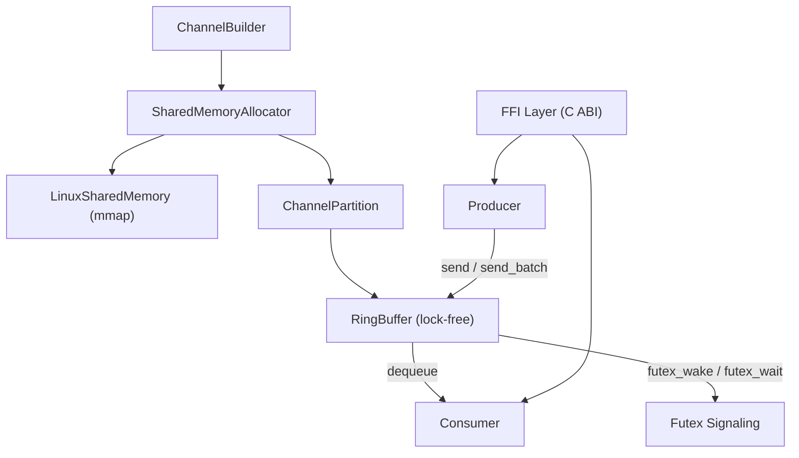
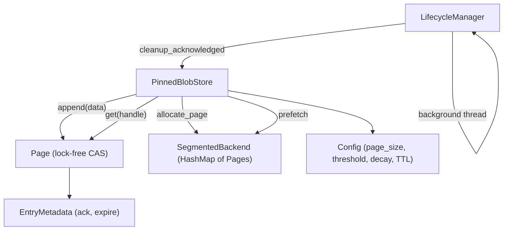

# Repository Walkthrough: DMXP-MPMC & stable-fragmented-buffer

## 1. DMXP-MPMC — Shared-Memory Message Queue

**Purpose:** Ultra-low-latency, cross-language, multi-producer multi-consumer (MPMC) message queue using Linux shared memory (`/dev/shm`). Designed for HFT, AI/ML pipelines, robotics, and localhost microservices.

### Architecture

### Key Modules

| Module | Location | Role |
|---|---|---|
| **SharedMemory** | [SharedMemory.rs](file:///Users/neeraj/Dev/DMXP/DMXP-MPMC/src/Core/SharedMemory.rs) | Cross-platform abstraction over [mmap](file:///Users/neeraj/Dev/DMXP/DMXP-MPMC/src/Core/SharedMemory.rs#167-200)/`memfd_create`. Creates/attaches to `/dev/shm` regions. 128-byte aligned. |
| **futex** | [futex.rs](file:///Users/neeraj/Dev/DMXP/DMXP-MPMC/src/Core/futex.rs) | Linux futex syscalls for [wait](file:///Users/neeraj/Dev/DMXP/DMXP-MPMC/src/Core/futex.rs#41-46)/[wake](file:///Users/neeraj/Dev/DMXP/DMXP-MPMC/src/Core/futex.rs#47-51) signaling; yields on non-Linux. |
| **alloc** | [mod.rs](file:///Users/neeraj/Dev/DMXP/DMXP-MPMC/src/Core/alloc/mod.rs) | [SharedMemoryAllocator](file:///Users/neeraj/Dev/DMXP/DMXP-MPMC/src/Core/alloc/mod.rs#26-32) — manages a global shared memory region with a `GlobalHeader`, channel table (`MAX_CHANNELS` entries), bump allocator. [ChannelPartition](file:///Users/neeraj/Dev/DMXP/DMXP-MPMC/src/Core/alloc/mod.rs#16-24) wraps a single channel's ring buffer. |
| **RingBuffer** | [Buffer_impl.rs](file:///Users/neeraj/Dev/DMXP/DMXP-MPMC/src/MPMC/Buffer/Buffer_impl.rs) | Lock-free MPMC ring buffer using atomic CAS on per-slot sequence numbers. Supports single [enqueue](file:///Users/neeraj/Dev/DMXP/DMXP-MPMC/src/MPMC/Buffer/Buffer_impl.rs#135-184)/[dequeue](file:///Users/neeraj/Dev/DMXP/DMXP-MPMC/src/MPMC/Buffer/Buffer_impl.rs#185-232) and batch operations. Each slot has inline payload space (`MSG_INLINE`). |
| **Producer** | [producer.rs](file:///Users/neeraj/Dev/DMXP/DMXP-MPMC/src/MPMC/producer.rs) | [send()](file:///Users/neeraj/Dev/DMXP/DMXP-MPMC/src/MPMC/producer.rs#92-154) / [send_batch()](file:///Users/neeraj/Dev/DMXP/DMXP-MPMC/src/MPMC/producer.rs#39-91) — writes [MessageMeta](file:///Users/neeraj/Dev/DMXP/DMXP-MPMC/src/ffi.rs#29-39) + payload into ring buffer slots, signals consumer via futex. |
| **Consumer** | [consumer.rs](file:///Users/neeraj/Dev/DMXP/DMXP-MPMC/src/MPMC/consumer.rs) | [receive()](file:///Users/neeraj/Dev/DMXP/DMXP-MPMC/src/MPMC/consumer.rs#44-54) / [receive_blocking()](file:///Users/neeraj/Dev/DMXP/DMXP-MPMC/src/MPMC/consumer.rs#77-82) / [receive_timeout()](file:///Users/neeraj/Dev/DMXP/DMXP-MPMC/src/MPMC/consumer.rs#127-140) — dequeues from ring buffer. Supports blocking (futex wait) and timeout modes. |
| **ChannelBuilder** | [builder.rs](file:///Users/neeraj/Dev/DMXP/DMXP-MPMC/src/MPMC/builder.rs) | Builder pattern: configure [buffer_size](file:///Users/neeraj/Dev/DMXP/DMXP-MPMC/src/MPMC/builder.rs#25-29), [channel_id](file:///Users/neeraj/Dev/DMXP/DMXP-MPMC/src/MPMC/producer.rs#155-159), [capacity](file:///Users/neeraj/Dev/DMXP/DMXP-MPMC/src/MPMC/builder.rs#63-67) → build [Producer](file:///Users/neeraj/Dev/DMXP/DMXP-MPMC/src/MPMC/producer.rs#11-19) or [Consumer](file:///Users/neeraj/Dev/DMXP/DMXP-MPMC/src/MPMC/consumer.rs#11-18). Auto-creates/attaches to shared memory. |
| **FFI** | [ffi.rs](file:///Users/neeraj/Dev/DMXP/DMXP-MPMC/src/ffi.rs) | C ABI (`extern "C"`) — `dmxp_producer_new/send/send_batch/free`, `dmxp_consumer_new/receive/receive_ext/free`, `dmxp_channel_count/list_channels`. Used by Python, Go, C consumers. |

### Data Flow

1. **Producer** calls `ChannelBuilder::build_producer()` → allocator creates/attaches SHM, creates channel
2. `producer.send(msg)` → atomically reserves a ring buffer slot (CAS on `head`), writes [MessageMeta](file:///Users/neeraj/Dev/DMXP/DMXP-MPMC/src/ffi.rs#29-39) + payload, publishes via sequence number, calls [futex_wake](file:///Users/neeraj/Dev/DMXP/DMXP-MPMC/src/Core/futex.rs#47-51)
3. **Consumer** calls `ChannelBuilder::build_consumer()` → attaches to existing SHM + channel
4. `consumer.receive()` → atomically reads from `tail`, copies payload out, advances sequence number

### Key Design Choices

- **Lock-free ring buffer** with per-slot sequence numbers (Lamport-like MPMC pattern)
- **Shared memory** via `/dev/shm` for zero-copy IPC across languages
- **Futex-based** blocking/waking for low-latency consumer notification
- **Linux-only** (non-Linux stubs exist but return `Unsupported`)
- Builds as both `cdylib` (FFI) and `rlib` (Rust library)

---

## 2. stable-fragmented-buffer — Pointer-Stable Blob Store

**Purpose:** A high-performance, in-memory blob storage system that grows dynamically **without invalidating existing pointers**. Uses fixed-size pages so data is never relocated. Elastic lifecycle management prevents allocation latency spikes and memory thrashing.

### Architecture

### Key Modules

| Module | Location | Role |
|---|---|---|
| **PinnedBlobStore** | [store.rs](file:///Users/neeraj/Dev/DMXP/stable-fragmented-buffer/src/page/store.rs) | Main API: [append()](file:///Users/neeraj/Dev/DMXP/stable-fragmented-buffer/src/page/store.rs#97-171) → [BlobHandle](file:///Users/neeraj/Dev/DMXP/stable-fragmented-buffer/src/types/types.rs#8-30), [get()](file:///Users/neeraj/Dev/DMXP/stable-fragmented-buffer/src/page/page.rs#156-167), [acknowledge()](file:///Users/neeraj/Dev/DMXP/stable-fragmented-buffer/src/page/store.rs#312-322), [cleanup_acknowledged()](file:///Users/neeraj/Dev/DMXP/stable-fragmented-buffer/src/page/store.rs#323-392). Manages active page, prefetching, free-page recycling (min-heap). |
| **Page** | [page.rs](file:///Users/neeraj/Dev/DMXP/stable-fragmented-buffer/src/page/page.rs) | Fixed-size memory page. Lock-free [try_append()](file:///Users/neeraj/Dev/DMXP/stable-fragmented-buffer/src/page/page.rs#117-155) via `AtomicUsize` CAS. Tracks entries via `Vec<EntryMetadata>`. Supports partial append for multi-page writes. Decay logic (empty timestamp → timeout). |
| **SegmentedBackend** | [segmented.rs](file:///Users/neeraj/Dev/DMXP/stable-fragmented-buffer/src/backend/segmented.rs) | `HashMap<u32, Page>` — heap-allocated pages. Implements `StorageBackend` trait. |
| **LifecycleManager** | [lifecycle.rs](file:///Users/neeraj/Dev/DMXP/stable-fragmented-buffer/src/lifecycle/lifecycle.rs) | Background thread runs [maintenance_cycle()](file:///Users/neeraj/Dev/DMXP/stable-fragmented-buffer/src/lifecycle/lifecycle.rs#23-33) periodically; frees decayed pages. Uses `Weak<PinnedBlobStore>` to auto-stop when store is dropped. |
| **Types** | [types.rs](file:///Users/neeraj/Dev/DMXP/stable-fragmented-buffer/src/types/types.rs) | [BlobHandle](file:///Users/neeraj/Dev/DMXP/stable-fragmented-buffer/src/types/types.rs#8-30) (32 bytes: page_id, offset, size, timestamp, generation, end_page_id, total_size), [Config](file:///Users/neeraj/Dev/DMXP/stable-fragmented-buffer/src/types/types.rs#138-151), `BlobError` enum. |
| **Profiler** | `src/profiling/` | Metrics collection for append/get latencies. |

### Data Flow

1. `PinnedBlobStore::new(config)` → allocates initial page via `SegmentedBackend`
2. `store.append(data)` → tries current page's `try_append()` (CAS on `used` counter). If page full, allocates next page. If data > page size, uses `append_multi_page()`. Returns `BlobHandle`.
3. `store.get(&handle)` → reads `page_id` + `offset` from handle, fetches page from backend, copies slice
4. `store.acknowledge(&handle)` → marks entry for cleanup
5. `LifecycleManager` runs periodically → scans pages for fully-acknowledged/expired entries → frees decayed empty pages, recycles IDs

### Key Design Choices

- **Pointer stability**: data is never moved; pages are allocated independently and never reallocated
- **Page prefetching** at 80% threshold to eliminate allocation latency
- **Decay with hysteresis**: empty pages kept alive for `decay_timeout_ms` before freeing
- **Free-page recycling** via `BinaryHeap<Reverse<u32>>` (min-heap to fill holes)
- **Multi-page spanning** for data larger than a single page
- **TTL-based** entry expiration + explicit acknowledgment
- **Thread-safe** via `parking_lot::RwLock` on backend + atomics on pages

---

## 3. How They Relate

Both are part of the **DMXP** (Dual-Mode Exchange Protocol) project — a systems-level data infrastructure:

| Aspect | DMXP-MPMC | stable-fragmented-buffer |
|---|---|---|
| **Purpose** | Message passing (queue) | Blob storage (buffer) |
| **Memory model** | Shared memory (IPC, `/dev/shm`) | In-process heap pages |
| **Concurrency** | Lock-free ring buffer (atomic CAS) | Lock-free append (atomic CAS) |
| **Data lifecycle** | Consume-once from queue | TTL + explicit acknowledge |
| **Cross-language** | Yes (C FFI) | Rust only |
| **Platform** | Linux only | Cross-platform |

> [!TIP]
> These two can work together: DMXP-MPMC passes `BlobHandle` references between processes, while stable-fragmented-buffer stores the actual large payloads in a pointer-stable buffer, avoiding the need to copy large blobs through the ring buffer.
